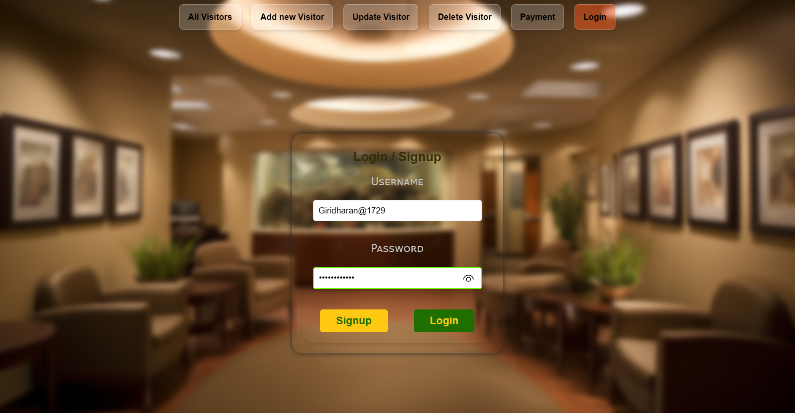
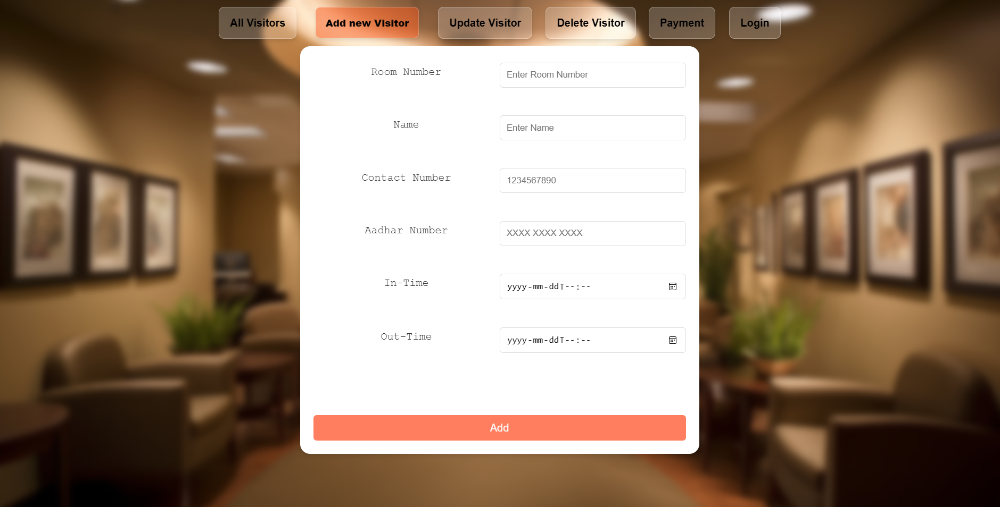
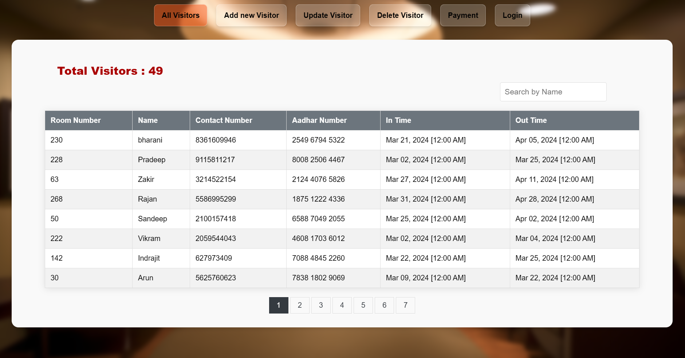

# Visitor Management System 🌟


Welcome to the **Visitor Management System**! This project is designed to efficiently manage visitors using modern web technologies like Angular, Node.js, TypeScript, MongoDB, and RESTful APIs. The system also includes payment services for enhanced functionalities.



## 🚀 Features

- **Real-time Visitor Tracking**: Keep track of visitors in real-time.
- **Secure Payments**: Integrated payment services for premium features.
- **Responsive Design**: Mobile-friendly interface.
- **Comprehensive Dashboard**: Overview of visitor statistics.
- **Easy Integration**: Simple API for integrating with other systems.
- **Text Extraction**: Extract text content from visitor inputs.

## 🛠️ Technologies Used

- **Frontend**: Angular, TypeScript
- **Backend**: Node.js, Express.js
- **Database**: MongoDB
- **API**: RESTful services
- **Payments**: Integrated GPay component

## 📸 Screenshots




## 📋 Prerequisites

- Node.js & npm: [Download and Install](https://nodejs.org/)
- MongoDB: [Download and Install](https://www.mongodb.com/try/download/community)

## 📦 Installation

1. **Clone the repository**
    ```sh
    git clone https://github.com/GiridharanS1729/visitor-management-system.git
    cd visitor-management-system
    ```

2. **Install dependencies for the frontend**
    ```sh
    npm install
    ```

3. **Install dependencies for the backend**
    ```sh
    cd src/server
    npm install
    ```


## 🚀 Running the Application

### Running the Backend

1. **Open Terminal 1**
2. **Navigate to the backend folder**
    ```sh
    cd visitor-management-system/backend/server
    ```
3. **Run the backend server**
    ```sh
    npm start
    ```

    The backend server will be available at `http://localhost:4201`

### Running the Frontend

1. **Open Terminal 2**
2. **Navigate to the root project directory**
    ```sh
    cd visitor-management-system
    ```
3. **Run the frontend server**
    ```sh
    npm start
    ```

    The frontend application will be available at `http://localhost:4200`

## 🚦 How to Use

1. **Register an Account**: Sign up as an admin to manage visitors.
2. **Login**: Log in using your credentials to access the main page.
3. **Add Visitors**: Add visitor details through the dashboard.
4. **Extract Text Content**: Use the text extraction feature to capture visitor details.
5. **Track Visitors**: Monitor the entry and exit of visitors in real-time.
6. **CRUD Operations**: Perform Create, Read, Update, and Delete operations on visitor data using the integrated API.
7. **Payment**: Users can pay using the integrated GPay component for any premium features.

## 🤝 Contributing

We welcome contributions! Please read our [CONTRIBUTING.md](https://github.com/GiridharanS1729/visitor-management-system/blob/main/CONTRIBUTING.md) for guidelines on how to contribute to the project.

## 📫 Contact

For any inquiries or issues, please contact us at:
- **Email**: giridharans1729@gmail.com
- **Twitter**: [@GiridharanS1729](https://x.com/Giridharans1729)
- **LinkedIn**: [@giridharans1729](https://www.linkedin.com/in/giridharans1729/)

## 📜 License

This project is licensed under the MIT License. See the [LICENSE](https://github.com/GiridharanS1729/visitor-management-system/blob/main/LICENSE) file for more details.

---

Made with ❤️ by [Giridharan S](https://github.com/GiridharanS1729)


